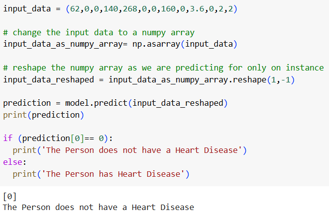

# Heart_Health_Predict
Heart Disease Prediction using Machine Learning

This project leverages machine learning to predict whether a person has heart disease based on various medical and demographic features. The model is trained using a health dataset and predicts heart disease risk based on features such as age, cholesterol levels, blood pressure, exercise habits, and more.

# Features
1.Data Preprocessing: Clean and prepare the dataset by handling missing values, scaling numerical features, and encoding categorical data.
2.Model Training: Train a classification model (e.g., Logistic Regression, Random Forest, etc.) to predict heart disease based on input features.
3.Prediction: Make predictions for new individuals based on their medical information.
4.Evaluation: Evaluate model performance using metrics like accuracy, precision, recall, and F1-score.

# Example Evaluation

# License
This project is licensed under the MIT License.

